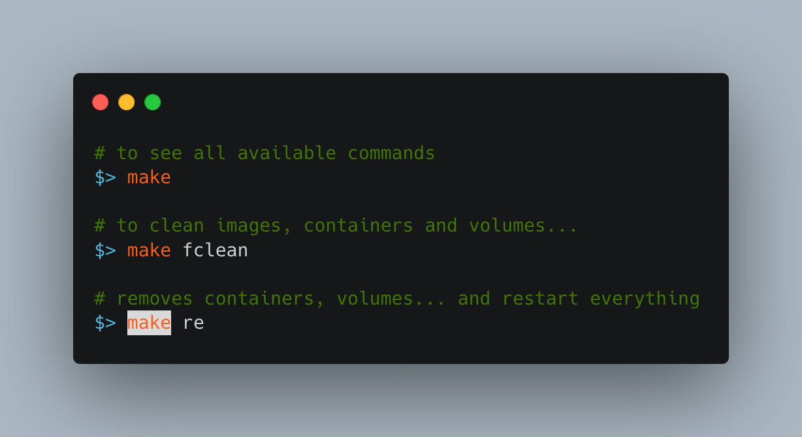

# AquaPong Website 🏓
Welcome to the AquaPong world! Here 🚀 , users can play single games of pingpong 🏓, take part in tournaments, and hone their skills while connecting with other users and tracking their progress and achievements 🏅.

# Index
1. [ Usage ](#usage)
2. [ Technologies Used ](#tech)
3. [ Conception ](#cons)
4. [ File Structure](#file)
5. [ Models ](#mode)
6. [ Preview ](#prev)
7. [ Ressources ](#ress)

<a name="usage"></a>
# Usage

You should first modify .env.example and rename it to .env !!

<a name="tech"></a>
# Technologies Used
<table class="steelBlueCols">
<thead>
<tr>
<th width=400 height=50>Part</th>
<th width=400 height=50 >Technology</th>
</tr>
</thead>
<tbody>
<tr>
<td><b>FrontEnd</b></td>
<td><a href="https://react.dev/" style="text-decoration:none;">  </a>
    <a href="https://tailwindui.com/" style="text-decoration:none;">  </a> 
    <a href="https://nextjs.org/" style="text-decoration:none;">  </a>
</td>
</tr>
<tr>
<td><b>Server</b></td>
<td> <a href="https://nginx.org/en/">  </a> </td>
</tr>
<tr>
<td><b>Containerization</b></td>
<td><a href="https://www.docker.com/"></a></td>
</tr>
<tr>
<td>cell1_4</td>
<td>cell2_4</td>
</tr>
<tr>
<td>cell1_5</td>
<td>cell2_5</td>
</tr>
<tr>
<td>cell1_6</td>
<td>cell2_6</td>
</tr>
<tr>
<td>cell1_7</td>
<td>cell2_7</td>
</tr>
<tr>
<td>cell1_8</td>
<td>cell2_8</td>
</tr>
<tr>
<td>cell1_9</td>
<td>cell2_9</td>
</tr>
<tr>
<td>cell1_10</td>
<td>cell2_10</td>
</tr>
</tbody>
</table>

<a name="cons"></a>
# Conception
<picture >

<a name="mode"></a>
# Models

<a name="prev"></a>
# Preview

<a name="file"></a>
# File Structure
```bash
django_backend
│   ├── Dashboard_home
│   ├── Sign_up
│   ├── chat
│   ├── django_backend
│   ├── groups
│   ├── notification
│   ├── playground
frontend
│   ├── app
│   │   ├── (firstSide)
│   │   │   │   ├── signIn
│   │   │   │   ├── signUp
│   │   │   ├── landingPage
│   │   ├── (playground)
│   │   │   ├── playground
│   │   │   ├── privateGame
│   │   │   ├── tournament
│   │   ├── (scondSide)
│   │   │   ├── chatPage
│   │   │   ├── clanPage
│   │   │   ├── gamePage
│   │   │   ├── homePage
│   │   │   │   ├── [id]
│   │   │   ├── setPassword
│   │   │   ├── settingsPage
│   │   ├── ErrorPage
│   │   ├── api
│   │   ├── assets
│   │   ├── callback
│   │   ├── chat
│   │   ├── components
│   │   ├── contexts
│   │   ├── globalchat
│   │   ├── group_chat
│   │   ├── styles
│   │   ├── utils
│   ├── public
│   │   ├── clans
│   │   ├── gameElement
│   │   ├── maps
│   │   ├── ranks
│   │   ├── soundEffect
```

<a name="ress"></a>
# Ressources

https://nextjs.org/

https://codevoweb.com/django-implement-2fa-two-factor-authentication/

https://auth0.com/blog/refresh-tokens-what-are-they-and-when-to-use-them/#When-to-Use-Refresh-Tokens

https://www.django-rest-framework.org/api-guide/authentication/
