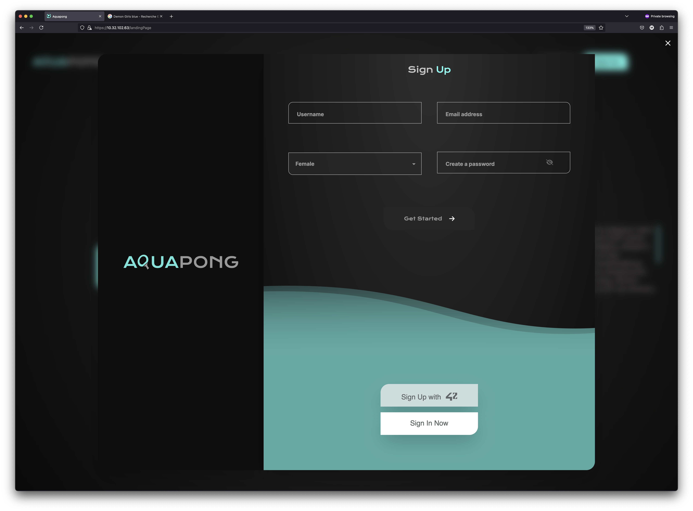
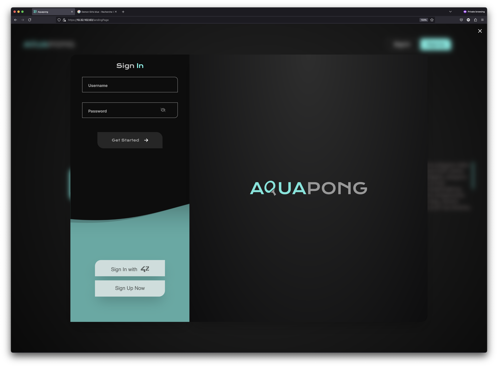
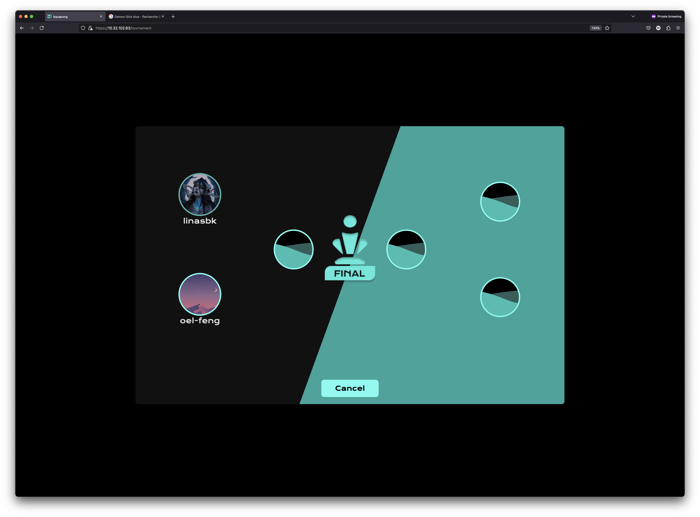

# AquaPong Website 🏓
Welcome to the AquaPong world! Here 🚀 , users can play single games of pingpong 🏓, take part in tournaments, and hone their skills while connecting with other users and tracking their progress and achievements 🏅.

# Index
1. [ Usage ](#usage)
2. [ Technologies Used ](#tech)
3. [ Conception ](#cons)
4. [ File Structure](#file)
5. [ Models ](#mode)
6. [ Preview ](#prev)
7. [ Ressources ](#ress)

<a name="usage"></a>
# Usage

You should first modify .env.example and rename it to .env !!

<a name="tech"></a>
# Technologies Used
<table class="steelBlueCols">
<thead>
<tr>
<th width=400 height=50>Part</th>
<th width=400 height=50 >Technology</th>
</tr>
</thead>
<tbody>
<tr>
<td><b>FrontEnd</b></td>
<td><a href="https://react.dev/" style="text-decoration:none;">  </a>
    <a href="https://tailwindui.com/" style="text-decoration:none;">  </a> 
    <a href="https://nextjs.org/" style="text-decoration:none;">  </a>
    <a href="https://threejs.org/" style="text-decoration:none;">  </a>
</td>
</tr>
<tr>
<td><b>Server</b></td>
<td> <a href="https://nginx.org/en/">  </a> </td>
</tr>
<tr>
<td><b>Containerization</b></td>
<td><a href="https://www.docker.com/"></a></td>
</tr>
<tr>
<td><b>BackEnd Frameworks</b></td>
<td>
    <a href="https://www.djangoproject.com/"></a>
    <a href="https://www.django-rest-framework.org/"></a>
</td>
</tr>
<tr>
<td><b>Languages</b></td>
<td>
    <a herf="https://developer.mozilla.org/en-US/docs/Web/HTML"></a>
    <a herf="https://developer.mozilla.org/en-US/docs/Web/CSS"></a>
    <a herf="https://developer.mozilla.org/en-US/docs/Web/JavaScript"></a>
    <a herf="https://www.python.org/psf-landing/"></a>
</td>
</tr>
<tr>
<td>Design</td>
<td> <a herf="https://www.figma.com/"></a></td>
</tr>
</tbody>
</table>

<a name="cons"></a>
# Conception

<a name="mode"></a>
# Models
<ul>
<li><b>Use a Framework as backend</b></li>
    <p>This module is really important because it uses a specific web framework in backend development, called Django. It has some great features,
        like MTV Architecture, which helps you organise your code into Models, Templates, and Views for cleaner, easier-to-maintain applications
      ORM: Makes database operations easier with Python objects.
      Admin Panel: Makes it simple to build backend interfaces.
      Built-in Security: Protects against common web vulnerabilities.
      Scalability: Makes sure your applications can handle high traffic.
      Community Support: Gives you access to a rich ecosystem of packages and resources.</p>
<li><b>Use Database for the backend</b></li>
    <p> This module ensures the consistency and compatibility of data across the website, 
        which is a prerequisite for the framework module, in this model, we use PostgreSQL an open-source database that uses SQL to store data,
        and is reliable and robust, and the open-source community behind it is dedicated to delivering innovative solutions. </p>
<li><b>Game Customization Options</b></li>
    <p>This module shows how to customize all the games on the platform. We want to:
        We'll offer customization features like different maps to improve gameplay.
        Users can choose a simpler version of the game with basic features.
        All games on the platform should have the same customization features.
        Users should be able to adjust game settings easily.</p>
<li><b>Standard user management, authentication, users across tournaments</b></li>
    <p>This module looks at how users interact with and access the Pong platform. It has two parts. One is about users taking part in different tournaments,The other is about using remote authentication.</p>
<li><b>Live chat</b></li>
    <p>In this module, we implement a chat functionality for your users. This enables users to send messages to other users, block them, and invite them to play a Pong game. Furthermore, users should be able to access other players' profiles.</p>
<li><b>User and Game Stats Dashboards</b></li>
    <p> In this module, we are creating a system showing statistical data about users and gaming sessions. </p>
<li>5 Minor module: Support on all devices.</li>
<li>6 Major module: Use of advanced 3D techniques.</li>
<li>7 Major module: Remote player</li>
<li>BONUS:</li>
<li>0.5 Minor module: Expanding Browser Compatibility.</li>
<li>Major module: Implement Two-Factor Authentication (2FA) and JWT Major module: Implementing a remote authentication.</li>
<li>PLUS:</li>
<li>0.5 Minor module: Server-Side Rendering (SSR) Integration</li>
</ul>

<a name="prev"></a>
# Preview
<h4>LandingPage</h4>


<h4>SignUp</h4>


<h4>SignIn</h4>


<h4>Settings</h4>


<h4>Two Factor Auth</h4>


<h4>Dashboard</h4>


<h4>Profile</h4>


<h4>PrivateChat</h4>


<h4>View Profile</h4>


<h4>Join Clan</h4>


<h4>Map</h4>


<h4>Solo Match</h4>


<h4>Tournament</h4>


<h4>3D Game</h4>


<a name="file"></a>
# File Structure
```bash
django_backend
│   ├── Dashboard_home
│   ├── Sign_up
│   ├── chat
│   ├── django_backend
│   ├── groups
│   ├── notification
│   ├── playground
frontend
│   ├── app
│   │   ├── (firstSide)
│   │   │   │   ├── signIn
│   │   │   │   ├── signUp
│   │   │   ├── landingPage
│   │   ├── (playground)
│   │   │   ├── playground
│   │   │   ├── privateGame
│   │   │   ├── tournament
│   │   ├── (scondSide)
│   │   │   ├── chatPage
│   │   │   ├── clanPage
│   │   │   ├── gamePage
│   │   │   ├── homePage
│   │   │   │   ├── [id]
│   │   │   ├── setPassword
│   │   │   ├── settingsPage
│   │   ├── ErrorPage
│   │   ├── api
│   │   ├── assets
│   │   ├── callback
│   │   ├── chat
│   │   ├── components
│   │   ├── contexts
│   │   ├── globalchat
│   │   ├── group_chat
│   │   ├── styles
│   │   ├── utils
│   ├── public
│   │   ├── clans
│   │   ├── gameElement
│   │   ├── maps
│   │   ├── ranks
│   │   ├── soundEffect
```

<a name="ress"></a>
# Ressources

https://nextjs.org/

https://codevoweb.com/django-implement-2fa-two-factor-authentication/

https://auth0.com/blog/refresh-tokens-what-are-they-and-when-to-use-them/#When-to-Use-Refresh-Tokens

https://www.django-rest-framework.org/api-guide/authentication/
